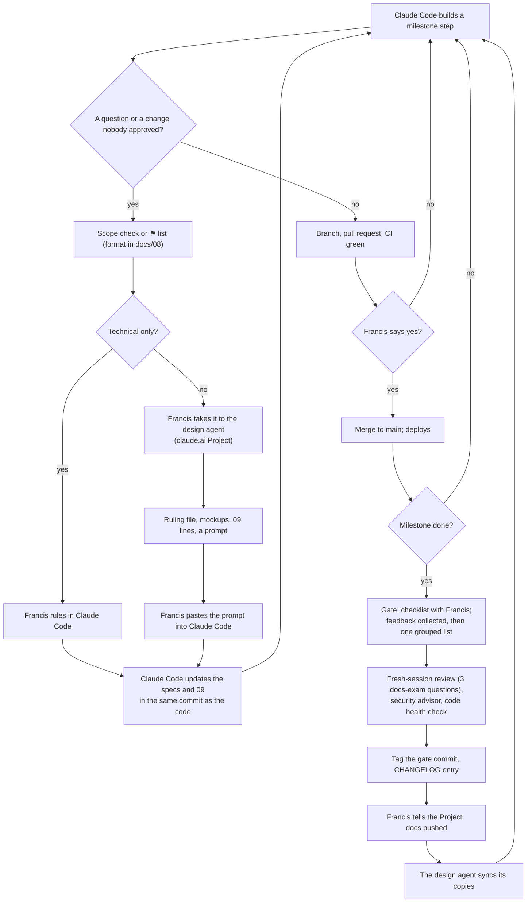

# Design-and-build loop

Who does what between a question and a shipped, documented change. Described in `docs/00-start-here.md` ("Who does what") and the root `CLAUDE.md` ("How work flows").

```mermaid
flowchart TD
  cc[Claude Code builds a milestone step] --> q{A question or a change nobody approved?}
  q -- no --> pr[Branch, pull request, CI green]
  q -- yes --> scope["Scope check or ⚑ list (format in docs/08)"]
  scope --> tech{Technical only?}
  tech -- yes --> francis1[Francis rules in Claude Code]
  tech -- no --> design["Francis takes it to the design agent<br>(claude.ai Project)"]
  design --> ruling["Ruling file, mockups, 09 lines, a prompt"]
  ruling --> paste[Francis pastes the prompt into Claude Code]
  francis1 --> docs
  paste --> docs["Claude Code updates the specs and 09<br>in the same commit as the code"]
  docs --> cc
  pr --> yes{Francis says yes?}
  yes -- no --> cc
  yes -- yes --> merge[Merge to main; deploys]
  merge --> gate{Milestone done?}
  gate -- no --> cc
  gate -- yes --> gaterun["Gate: checklist with Francis;<br>feedback collected, then one grouped list"]
  gaterun --> review["Fresh-session review (3 docs-exam questions),<br>security advisor, code health check"]
  review --> tag[Tag the gate commit, CHANGELOG entry]
  tag --> pushed["Francis tells the Project: docs pushed"]
  pushed --> sync[The design agent syncs its copies]
  sync --> cc
```
